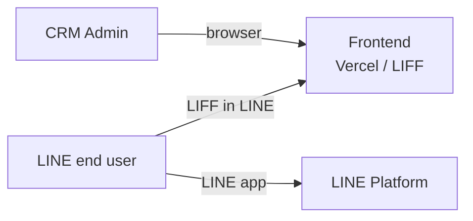
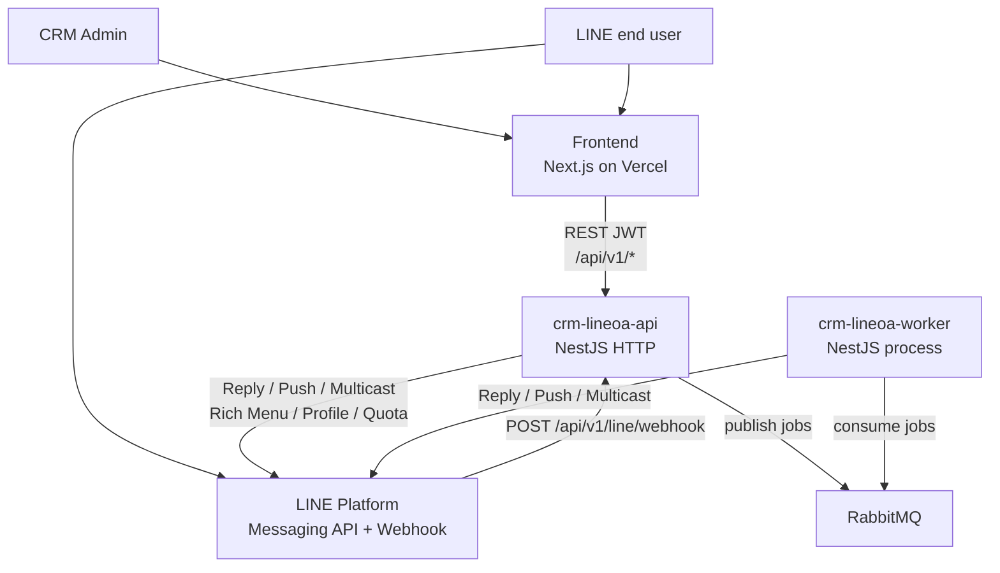
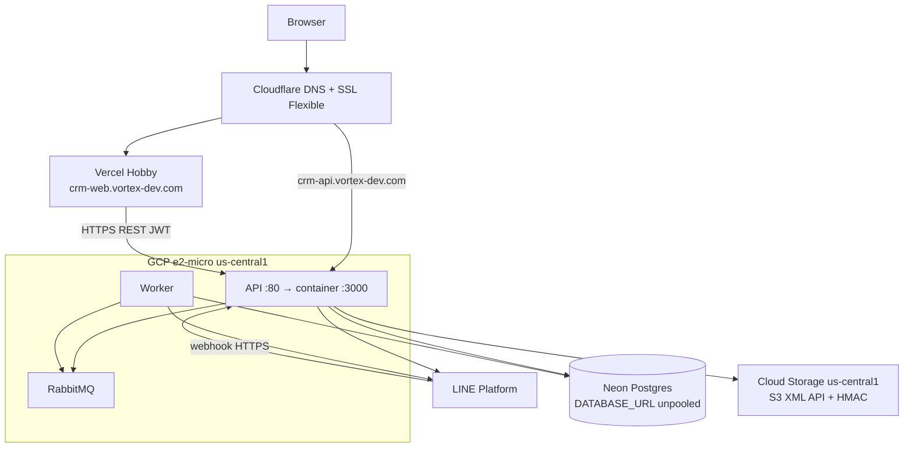

# System context

ภาพรวมว่า **ใครคุยกับระบบนี้** และระบบนี้อยู่ตรงไหนระหว่าง Frontend, LINE, API, Worker

Repo นี้คือ **backend เท่านั้น** (`crm-lineoa-api`). Frontend อยู่ repo แยก `crm-lineoa-web`

---

## ระบบนี้ทำอะไร

CRM สำหรับจัดการ LINE Official Account: ดูเพื่อน, ส่ง broadcast, ตั้ง auto-reply, rich menu, template, และรับ webhook จาก LINE

มี 2 process ใน repo นี้:

| Process | หน้าที่หลัก |
|---------|-------------|
| **API** (`src/main.ts`) | รับ HTTP จาก Frontend / LIFF / LINE webhook |
| **Worker** (`src/worker/main.ts`) | งาน async: ส่ง broadcast, ตอบ auto-reply, poll งาน scheduled |

---

## Actors



- **CRM Admin** — ใช้เว็บ CRM login ด้วย JWT
- **LINE end user** — คุยกับ OA ใน LINE; บาง flow เปิด LIFF (หน้า frontend) เพื่อ OTP เป็น Member

---

## System context



Frontend **ไม่คุยกับ Worker และไม่คุยกับ LINE โดยตรง** ทุกอย่างผ่าน API หรือผ่าน LINE Platform

---

## ที่ deploy จริง (portfolio)

ไม่ได้อยู่ AWS แล้ว — แยกตามชั้นเพื่อใช้ free tier



| ชั้น | ที่อยู่ | URL / หมายเหตุ |
|------|---------|----------------|
| Frontend | Vercel Hobby | `https://crm-web.vortex-dev.com` |
| API + Worker + RabbitMQ | GCP Always Free `e2-micro` (`us-central1`) | `https://crm-api.vortex-dev.com` — Cloudflare พร็อกซีพอร์ต 80 |
| PostgreSQL | Neon Free (Vercel-managed) | `DATABASE_URL` ใช้ **Direct / unpooled** ไม่ใช่ `-pooler` |
| ไฟล์ | GCS Standard `us-central1` | env `S3_*` ชี้ `storage.googleapis.com` |
| DNS / TLS | Cloudflare | เว็บ CNAME → Vercel; API A → IP VM, SSL **Flexible** |

VM ฟรีล็อก region สหรัฐ ส่วน Neon ที่สร้างผ่าน Vercel อาจอยู่ `ap-southeast-1` — latency สูงกว่าตอนทุกอย่างอยู่ Singapore แต่รับได้สำหรับ demo

---

## การเชื่อมต่อหลัก

### 1. Frontend → API

- REST ภายใต้ prefix `api/v1` (ยกเว้น `/metrics` และ Swagger `/docs`)
- Auth: JWT (`Authorization: Bearer`)
- CORS อนุญาต origin จาก `FRONTEND_URL`, `CORS_ORIGINS`, `LIFF_ENDPOINT_URL` และ localhost
- Frontend ชี้ API ด้วย `NEXT_PUBLIC_API_BASE_URL=https://crm-api.vortex-dev.com`

ตัวอย่างที่ Frontend เรียก: login, dashboard, broadcasts, templates, LINE users, rich menus, audiences, auto-messages, LINE OA settings

### 2. LINE Platform → API (webhook)

```
POST /api/v1/line/webhook
Header: X-Line-Signature
```

Webhook URL ที่ตั้งใน LINE Console:

`https://crm-api.vortex-dev.com/api/v1/line/webhook`

API ตรวจ signature แล้วจัดการ event (`follow`, `unfollow`, `message`, `postback`, …): บันทึกลง DB และถ้าต้อง auto-reply จะ **enqueue** ไป Worker ไม่ตอบ LINE จาก HTTP request ยาว ๆ

### 3. API / Worker → LINE Messaging API

| ใครเรียก | ใช้เมื่อ |
|----------|----------|
| API | ตั้งค่า OA, rich menu, ดึง profile/quota, welcome push ตอน follow |
| Worker | ส่ง broadcast (`multicast`), ตอบ auto-reply (`replyMessage` / `pushMessage`) |

### 4. API ↔ Worker ผ่าน RabbitMQ

ไม่มี HTTP ระหว่าง API กับ Worker — RabbitMQ อยู่บน VM เดียวกับ API (compose เดียวกัน ไม่เปิดพอร์ตออกเน็ต)

| Queue | Publisher | Consumer | งาน |
|-------|-----------|----------|-----|
| `broadcast.send` | API (กดส่ง) + Worker scheduler (ทุก 30 วินาที) | Worker | ส่งแคมเปญ |
| `auto-reply.process` | API (webhook message/postback) | Worker | ตอบตามกติกา auto-message |

### 5. API → object storage

อัปโหลดรูป template / rich menu ผ่าน MinIO client แบบ S3 ไป GCS (`S3_ENDPOINT=storage.googleapis.com`)

---

## ขอบเขตของ repo นี้

**อยู่ใน repo**

- HTTP API
- Worker
- Prisma schema / migrations
- Docker Compose สำหรับ infra (local) และ API+Worker+RabbitMQ (prod)
- GitHub Actions: build image บน CI → GHCR → GCP VM pull (`.github/workflows/deploy-prod.yml`)

**อยู่นอก repo**

- Frontend (`crm-lineoa-web` บน Vercel)
- LINE Developers Console
- Neon, GCS, Cloudflare — ดูที่ [02-containers.md](./02-containers.md)

---

## สิ่งที่ diagram นี้จงใจไม่ลงรายละเอียด

- Nest module ทีละตัว
- ทุก REST endpoint (ดู Swagger `/docs`)
- ตารางใน Postgres (ดู `prisma/schema.prisma`)
- Grafana / Prometheus (เป็น infra local ไม่ได้ deploy บน GCP)
