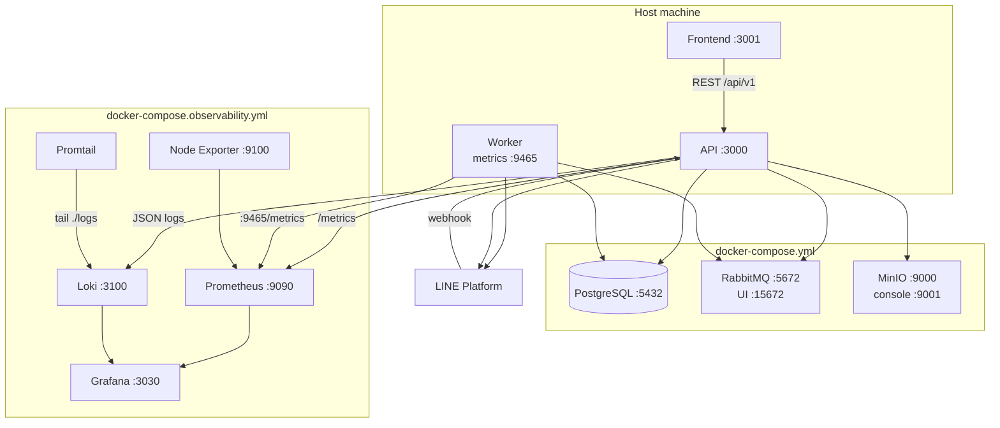
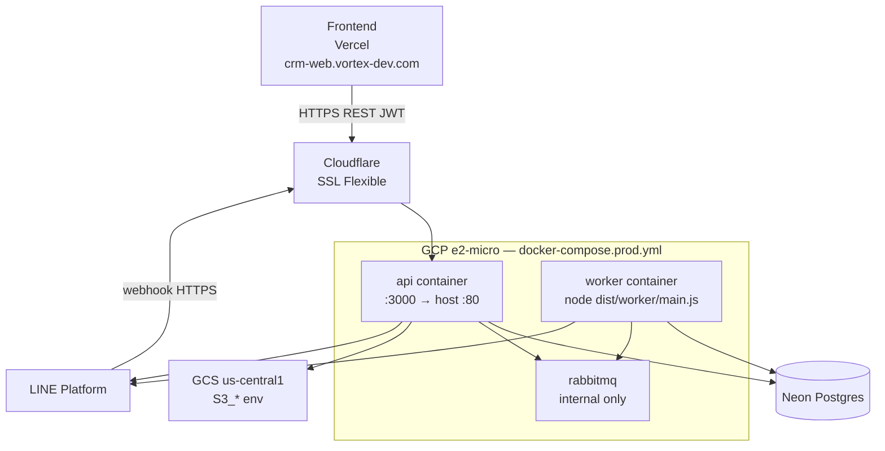
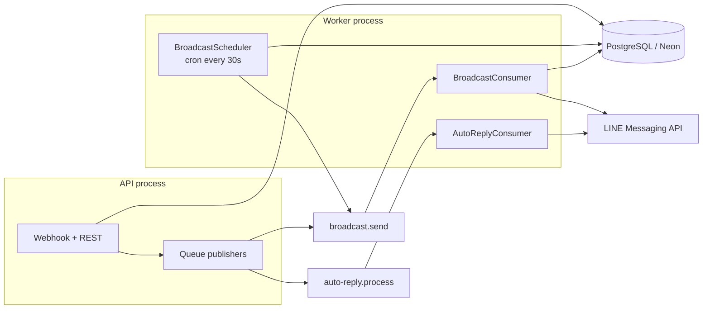

# Containers

process และ infra **ที่รันจริง** ของ `crm-lineoa-api`

แอปนี้แยกเป็น 2 process จากโค้ดชุดเดียวกัน:

| Process | Entry | HTTP |
|---------|-------|------|
| **API** | `src/main.ts` → `node dist/main.js` | ใน container `PORT=3000`, prefix `api/v1` — บน GCP map ออก host **พอร์ต 80** (`API_HOST_PORT=80`) |
| **Worker** | `src/worker/main.ts` → `node dist/worker/main.js` | metrics ที่ `WORKER_METRICS_PORT` (default 9465) เท่านั้น ไม่มี REST สำหรับ Frontend |

รัน local:

```bash
npm run start:dev          # API
npm run start:worker       # Worker
```

---

## Local (พัฒนาบนเครื่อง)

Infra อยู่ใน Docker, API/Worker รันบน host (Node) — **ยังเป็น Postgres + MinIO ใน compose** ไม่ได้บังคับให้ชี้ Neon/GCS ตอนพัฒนา



### บริการ local

| บริการ | มาจาก | Port / URL | บทบาท |
|--------|--------|------------|--------|
| API | `npm run start:dev` | `PORT` ใน `.env` (default 3000) | REST + webhook |
| Worker | `npm run start:worker` | metrics `9465` | consume queue, cron broadcast |
| Frontend | `crm-lineoa-web` | มักเป็น `:3001` | ถ้าชนพอร์ต ให้ API ใช้ `PORT=3001` |
| PostgreSQL | `docker-compose.yml` | `localhost:5432` | DB (`crm_lineoa_db`) |
| RabbitMQ | `docker-compose.yml` | `5672`, UI `15672` | queue `broadcast.send`, `auto-reply.process` |
| MinIO | `docker-compose.yml` | API `9000`, console `9001` | bucket `crm-oa-storage` |
| Prometheus | `docker-compose.observability.yml` | `9090` | scrape metrics |
| Grafana | ชุดเดียวกัน | `3030` (admin/admin) | dashboard CRM |
| Loki | ชุดเดียวกัน | `3100` | log |
| Promtail | ชุดเดียวกัน | — | อ่าน `./logs` ส่ง Loki |
| Node Exporter | ชุดเดียวกัน | `9100` | CPU/RAM/disk ของ host |

สตาร์ท infra:

```bash
docker compose up -d
npm run obs:up    # optional — Grafana stack
```

Prometheus scrape API ที่ `host.docker.internal:3001` (ดู `observability/prometheus/prometheus.yml`) ถ้า API ไม่ใช่พอร์ต 3001 ต้องแก้ scrape target ให้ตรง

Object storage local ใช้ MinIO ผ่าน env `S3_*` (S3-compatible)

---

## Production (GCP + Neon + GCS + Vercel)

จาก `docker-compose.prod.yml` + GitHub Actions (`deploy-prod.yml`)

GitHub Actions **build image บน CI** แล้ว push ไป **GHCR** (`ghcr.io/kittibank/crm-lineoa-api`)  
บน GCP VM (`e2-micro`, `us-central1`) มี **API, Worker, RabbitMQ** ใน Docker เดียวกัน — VM **pull image อย่างเดียว ไม่ build**  
**ไม่มี** Postgres / MinIO ใน compose นี้



| ชิ้น | ที่อยู่ | หมายเหตุ |
|------|---------|----------|
| `api` | image จาก GHCR (`API_IMAGE`) | `CMD node dist/main.js`, รัน migrate ถ้า `RUN_MIGRATIONS=true` |
| `worker` | image เดียวกัน | override command เป็น worker, `RUN_MIGRATIONS=false` |
| `rabbitmq` | container ใน `crm_network` | **ไม่เปิดพอร์ตออก host** |
| PostgreSQL | **Neon** | `DATABASE_URL` Direct/unpooled + `sslmode=require` |
| Object storage | **GCS** | `S3_ENDPOINT=storage.googleapis.com`, HMAC key |
| Frontend | Vercel | CORS ผ่าน `FRONTEND_URL` / `CORS_ORIGINS` / `LIFF_ENDPOINT_URL` |
| DNS / TLS | Cloudflare | API โดเมนพร็อกซีไปพอร์ต **80** ของ VM — อย่าใช้ SSL Full จนกว่าจะมี cert บน origin |
| Observability | ไม่ได้ขึ้นบน GCP | Grafana stack เป็นของ local |

Always Free ที่ต้องตรง: เครื่อง `e2-micro` + region `us-central1`/`us-west1`/`us-east1` + ดิสก์ **Standard** (ไม่ใช่ Balanced/SSD) + GCS bucket ใน US region เดียวกัน  
อย่าสร้าง Cloud SQL / Load Balancer บน GCP

Worker ขึ้นหลัง API healthy เพราะ API รัน migrate ก่อน

Deploy: tag `v*.*.*` หรือ **Actions → Deploy Production → Run workflow** — CI build/push ไป GHCR แล้ว SSH ไป **IP ของ VM** เพื่อ `docker pull` + `compose up --no-build` ไม่ใช่ `crm-api.vortex-dev.com` (Cloudflare ไม่พร็อกซีพอร์ต 22)

---

## Queue และใครเป็นคนยิง LINE

ไม่เปลี่ยนจากเดิม — คนละ process บน VM เดียวกัน



- **API** เขียน DB ทันทีตอน webhook (ข้อความ, follow/unfollow) แล้วโยนงานตอบไป queue
- **Worker** เป็นคนเรียก LINE Reply/Push/Multicast สำหรับ broadcast และ auto-reply
- **Scheduler** อยู่ใน Worker ไม่ใช่ API — ดึง broadcast สถานะ `scheduled` ที่ถึงเวลา แล้ว enqueue `broadcast.send`

---

## พอร์ตที่เจอบ่อย

| พอร์ต | บริการ |
|------|--------|
| 80 (prod host) | API ออกเน็ต — Cloudflare Flexible ยิงเข้าตรงนี้ |
| 3000 / 3001 | API หรือ Frontend ตอน local |
| 3030 | Grafana (map จาก container 3000) |
| 3100 | Loki |
| 5432 | Postgres local |
| 5672 | RabbitMQ AMQP (local หรือภายใน compose prod) |
| 9000 / 9001 | MinIO API / console (local เท่านั้น) |
| 9090 | Prometheus |
| 9100 | Node Exporter |
| 9465 | Worker `/metrics` |
| API `/metrics` | Prometheus scrape (นอก `api/v1`) |
| API `/docs` | Swagger |

---

## Source of truth ใน repo

| เรื่อง | ไฟล์ |
|-------|------|
| Process API / Worker | `src/main.ts`, `src/worker/main.ts` |
| Queue ชื่อ | `src/queue/queue.constants.ts` |
| Local infra | `docker-compose.yml` |
| Local Grafana stack | `docker-compose.observability.yml` |
| Prod compose | `docker-compose.prod.yml` |
| Image | `Dockerfile` |
| Env ตัวอย่าง | `.env.example` |
| Deploy GCP | `.github/workflows/deploy-prod.yml` (build on CI, pull on VM) |
| Prod image | `ghcr.io/kittibank/crm-lineoa-api` |
| Render prod `.env` | `scripts/deploy/render-env.sh` |
