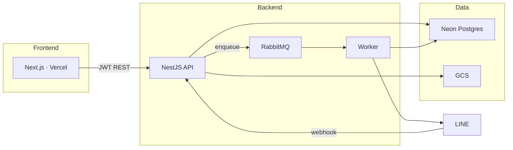
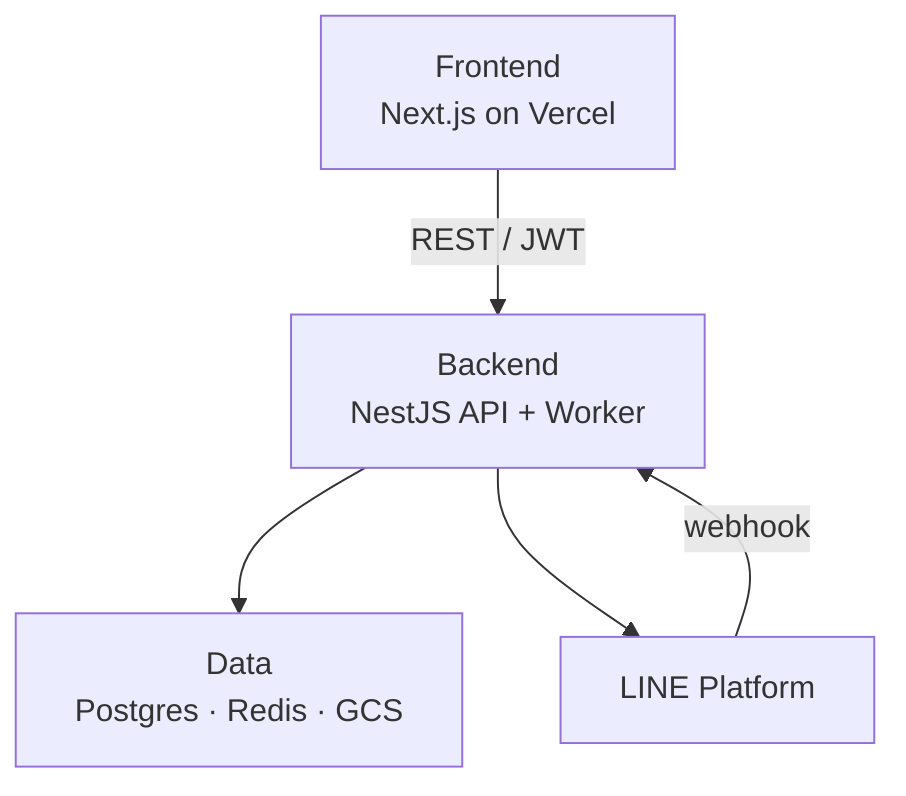
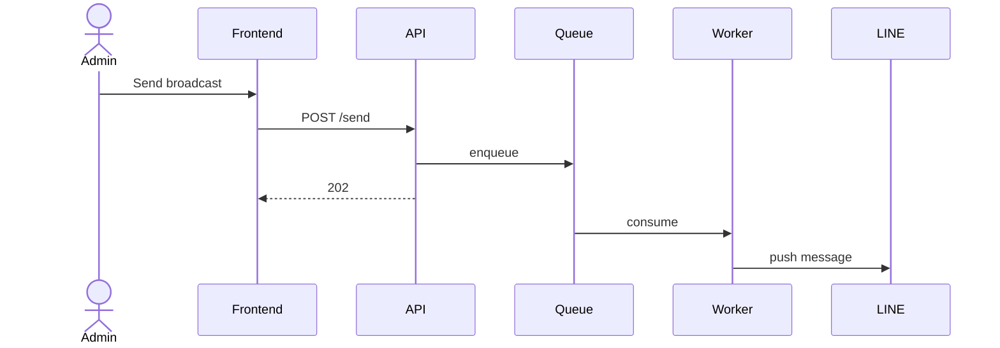
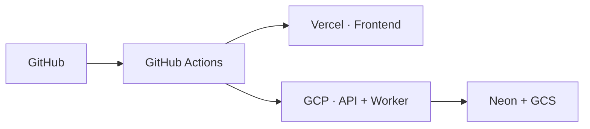
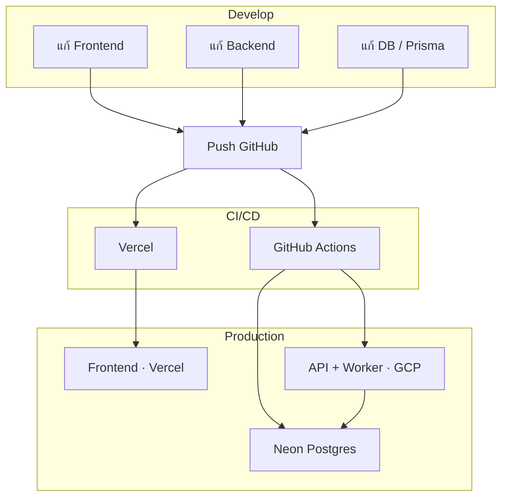
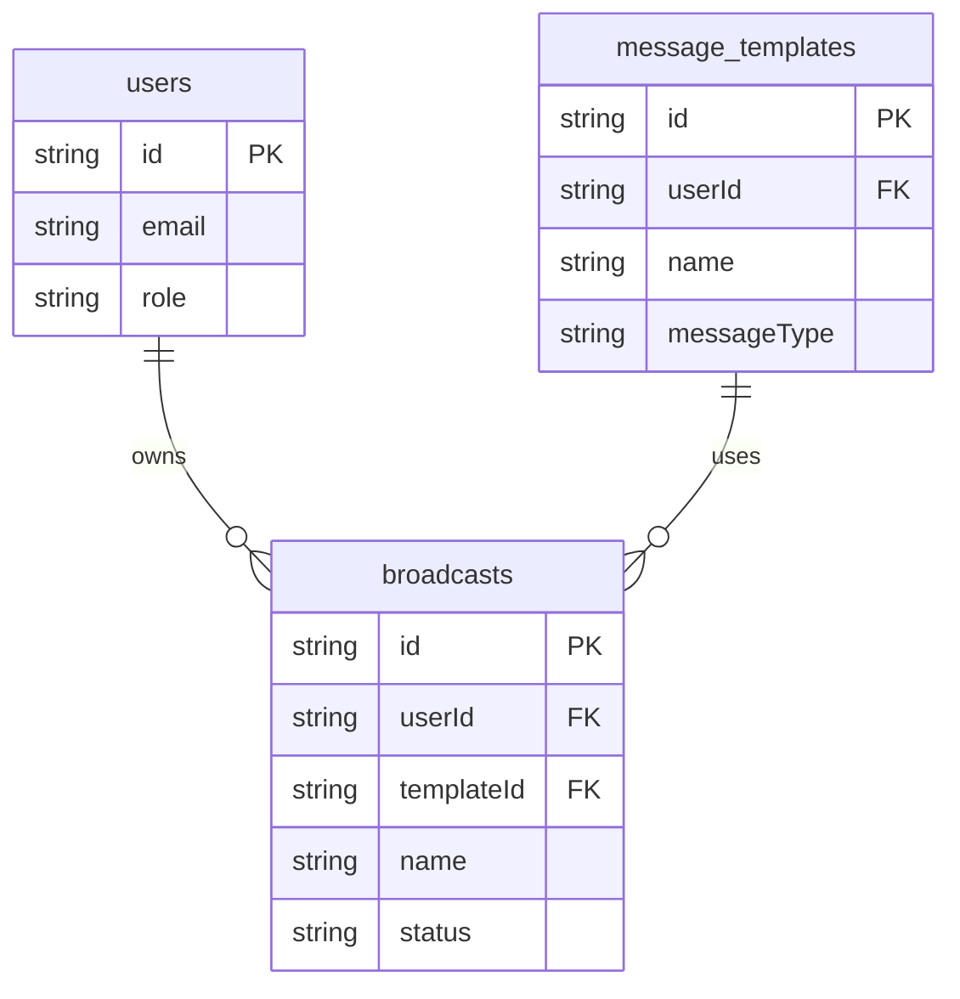

# CRM LINE OA — High-Level Architecture

Copy แต่ละบล็อกไป [mermaid.live](https://mermaid.live) แล้ว export PNG / SVG

---

## 1) System layers

---

## 2) Layers

---

## 3) Broadcast flow

---

## 4) Deploy

---

## 5) Develop → Deploy

---

## 6) ER example — 3 tables

